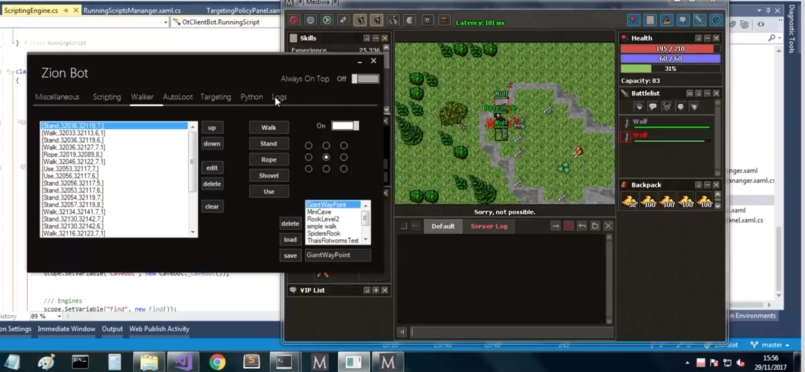

# ZionBot
A bot for 𝙼𝚎𝚍𝚒𝚟𝚒𝚊 𝚘𝚗𝚕𝚒𝚗𝚎 that uses context hooking to interact with the process of the game.

# Introdução
Este foi um bot que resolvi criar depois de ter feito o [CrystalBot](https://github.com/PimentelM/CrystalBot), que teve um bom sucesso entre as pessoas que o utilizaram e me inspirou à buscar um desafio maior criando um bot para uma versão diferente do jogo.

Ao invés de usar a API do windows para enviar sinais que simulavam a interação com teclado e mouse, o ZionBot foi projetado para interceptar a execução do código em determinadas áreas do jogo para poder executar suas ações, esta técnica é conhecida como context hooking.

O bot também emprega uma engine de execução de scripts em python, que permite que os usuários criem scripts personalizados em python que poderão ser executados em paralelo tendo acesso aos objetos de interação com o jogo. 

# Features implementadas no bot:
##### Cavebot consistindo em:
  * Autoloot
  * Targeting
  * Walker com sistema de waypoints
  * Video: https://www.youtube.com/watch?v=ZXlHADa9tfY
  
##### Scripting em python com àcesso ao:
  * GameMap
  * MiniMap
  * Iventory ( Equips, Containers, Items )
  * Battlelist ( Creatures )
  * Player
  * ScriptingEngine ( Os scripts tem acesso à própria scripting engine, haha... )
  * Packet ( Para enviar pacotes arbitrários para o servidor do jogo. )
  * Video: https://www.youtube.com/watch?v=kjfLmMMxCnE
  
##### Autofishing com detecção automática dos tiles de água  que contém peixes
##### Auto eat Food
##### Light hack ( sempre tem luz, mesmo dentro de cavernas. )
##### Rune maker ( cria runas automaticamente. )

# Aspectos técnicos do bot:

#### Hooking e execução de ações dentro do jogo

O hooking é feito através do uso de Breakpoints e Breakpoints Handlers. Insere-se na [engine de hooking](https://github.com/PimentelM/ZionBot/blob/master/ZionBot/Debugger/Debugger.cs) uma instância da classe “Breakpoint” que contém o endereço aonde será colocado o breakpoint e uma função do tipo "BreakPointHandler" ( Entender como um ponteiro de função. ), que será executado no instante em que o breakpoint for atingido.

A função poderá ler e modificar os conteúdos da memória do jogo e dos registradores daquela thread. Alguns hooks inclusive modificam o conteúdo dos endereços do stack, mudam o valor de EIP para pular a execução do código para outra função e depois retornam a execução do código normalmente através de outro breakpoint, desta forma é possível executar funções arbitrárias do jogo ( Como a de enviar pacotes. ) no contexto  da thread principal do jogo para evitar race conditions.

#### Scripting engine em Python

Foi utilizada uma biblioteca chamada IronPython que possibilita a integração entre código em C# e código em Python através de disponibilização de instâncias de objetos instanciados dentro do contexto do interpretador, assim, eu pude instanciar as classes que representam a API do jogo e coloca-las em variáveis globais dentro do interpretador.

# Sobre o desenvolvimento do bot:
Projeto iniciado na metade do ano de 2016, onde trabalhei nele intensamente até o início de 2017 quando comecei a trabalhar profissionalmente e comecei a mexer no projeto de forma mais esporádica.

Muitas horas de engenharia reversa das estruturas de dados e da arquitetura do código do jogo foram empregadas nesse projeto para que fosse desenvolvida uma interface de interação com os objetos e componentes do jogo ( API ), esta etapa levou algo em torno de três meses.

A arquitetura do bot foi inspirada no [YokoInjection](http://yoko.com.ua/eng/injection.htm), um utilitário para Ultima Online que permitia a execução de vários scripts em paralelo para execução de diversas tarefas, como healing, mining, etc...

As ferramentas utilizadas na criação desse bot foram as seguintes:

* [IDA Pro](https://www.hex-rays.com/products/ida/)
* [x64dbg](https://x64dbg.com/#start)
* [Visual Studio Community Edition](https://visualstudio.microsoft.com/)
* [Cheat Engine](https://www.cheatengine.org/)
* [HxD](https://mh-nexus.de/en/hxd/)
* [Setdllcharacteristics](https://blog.didierstevens.com/2010/10/17/setdllcharacteristics/)

## Considerações sobre o estado atual do bot:
O bot ainda está funcional no dia de hoje (14/07/2019), porém é necessário que sejam atualizados os endereços de memória utilizados pelo bot para instalar os hooks e ler os dados existentes no client do jogo.

Estes endereços se encontram no arquivo [Address.cs](https://github.com/PimentelM/ZionBot/blob/master/ZionBot/Statics/Address.cs)

---
Agradecimentos espciais ao Nick Cano, que é uma grande refrência na comunidade de Game Hacking e me ajudou com os insights providos no seu livro *Game Hacking: Developing Autonomous Bots for Online Games*.

